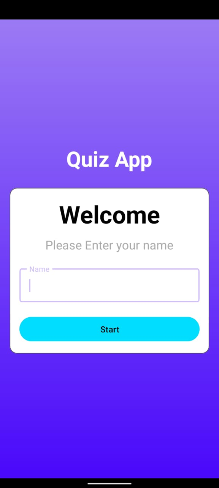
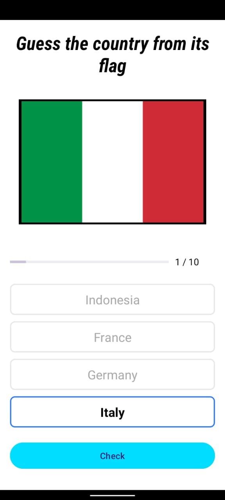
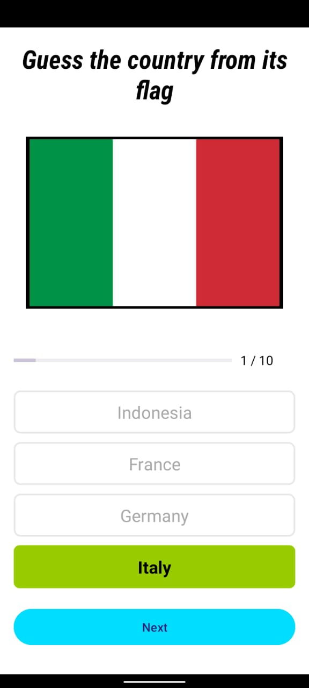
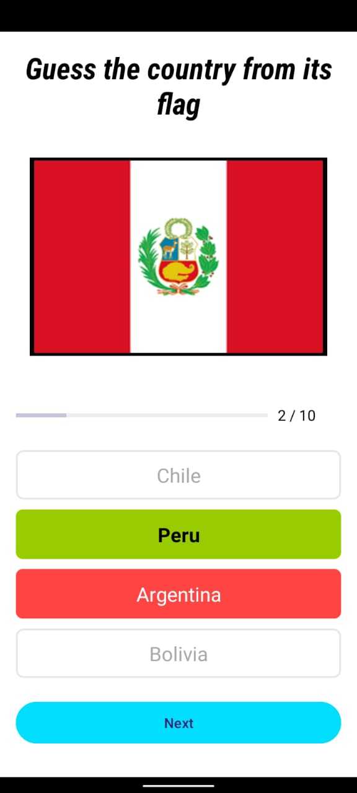
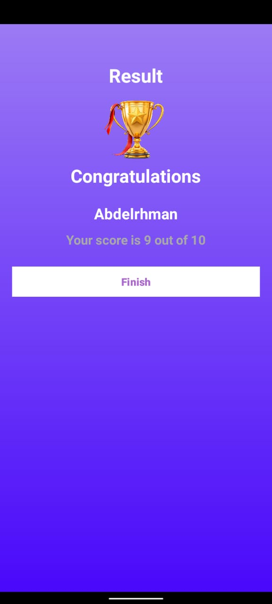

# 🎯 Quiz App

A simple Android quiz application built with Kotlin and XML.

## 📱 Features

* Enter your name before starting the quiz.
* Answer 10 random questions selected from a question bank.
* Questions are not repeated during the same quiz session.
* Change your selected answer before pressing **Check**.
* After pressing **Check**, the app validates your answer and displays:
  * 🟢 Correct answer in green.
  * 🔴 Wrong answer in red.
* Track your progress during the quiz.
* View your final score on the result screen.
* Restart the quiz and play again.

## 🛠 Technologies Used

* Kotlin
* Android Studio
* XML Layouts

## 📸 Screenshots

| Main Screen | Selected Answer | Correct Answer | Wrong Answer | Result Screen |
| :-: | :-: | :-: | :-: | :-: |
|  |  |  |  |  |

## 📥 Download APK

🚀 **[Click Here to Download Flag Quiz APK](apk/Flag_Quiz.apk?raw=true)**

## 🎮 App Flow

1. Enter your name.
2. Start the quiz.
3. Answer 10 random questions.
4. Press **Check** to validate your answer.
5. Continue until all questions are completed.
6. View your final score on the result screen.

## 👨‍💻 Developer

Abdelrhman Yasser